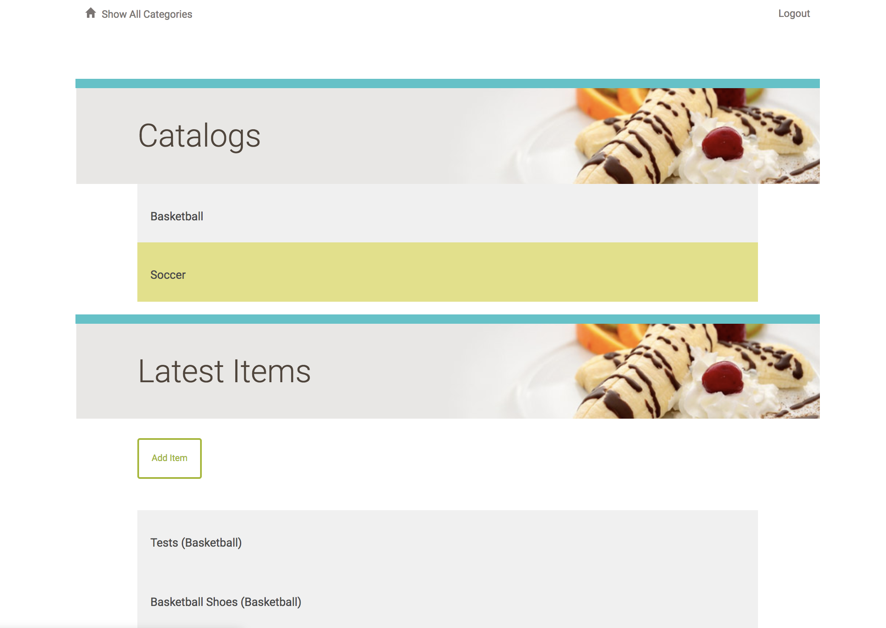
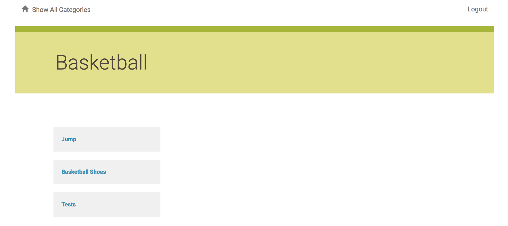
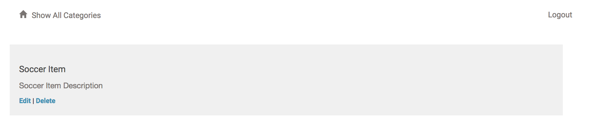
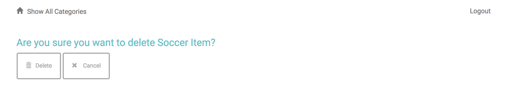
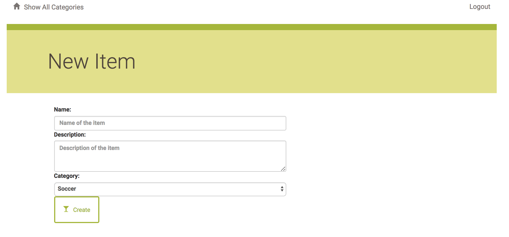

# Item Catalog
## Project Description:
The Item Catalog project consists of developing an application that provides a list of items within a variety of categories, as well as provide a user registration and authentication system. Registered users will have the ability to post, edit and delete their own items.

## Setting Up The Project Environment:
Here are the steps to set up the project environment to run it:

1. Install Vagrant from https://www.vagrantup.com.
2. Install VirtualBox from https://www.virtualbox.org.
3. Clone or download my project.
4. Upzip as needed and copy all files into the vagrant directory.
5. Open Terminal and navigate to the project folder.
6. cd into the vagrant directory
7. Run ``` vagrant up ``` to build the VM.
8. After vagrant is up and running, run ``` vagrant ssh ```.
9. cd into the project directory: ``` cd /vagrant ```
10. Load the data using the following command: ``` psql -d news -f newsdata.sql ```
11. Run ``` python project.py ```
12. Then open up your browser and type http://localhost:5000

## How to use:
In the main page, you will see the categories and latest added items:
> [](Image)

Clicking on a category shows you the items under that category:
> [](Image)

Clicking on an item shows you the item detail:
> [](Image)

You can edit or delete item **only if you are authenticated and you are the creator of that item.**
> [](Image)

You can create a new item **if you are authenticated.**
> [](Image)
